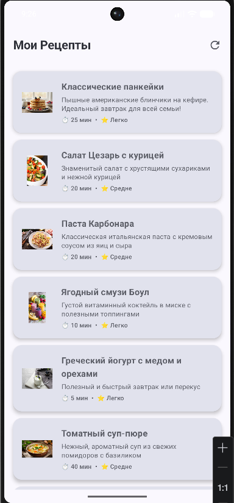
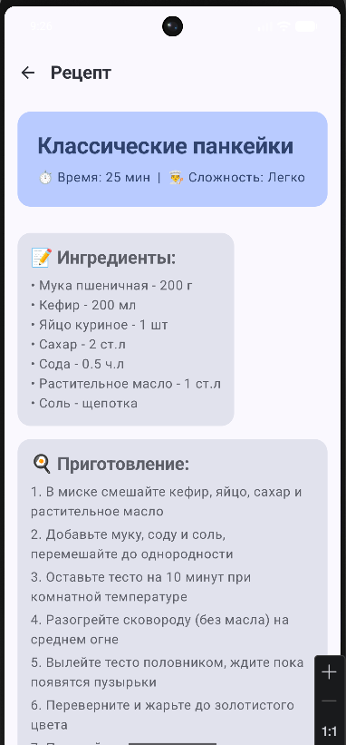

# My Cookbook (Мои Рецепты)

## Описание
"Мои Рецепты" — это мобильное приложение-каталог кулинарных рецептов. Приложение позволяет просматривать список блюд и смотреть подробную информацию о каждом рецепте: ингредиенты, пошаговый процесс приготовления, время готовки и сложность.

## Функциональность
- Отображение списка из 10 рецептов с картинками
- Экран с детальной информацией о рецепте
- Навигация между главным экраном и экраном деталей
- Кнопка обновления списка
- Асинхронная загрузка данных

## Технологии
- Kotlin
- Jetpack Compose
- Navigation Compose
- ViewModel + StateFlow
- Kotlin Coroutines
- Material Design 3

## Скриншоты
### Главный экран (список рецептов)

## Как запустить
1. Откройте проект в Android Studio
2. Дождитесь синхронизации Gradle
3. Подключите эмулятор или реальное устройство
4. Нажмите кнопку Run

## Автор и дата
**Студент:** [Чайкалак Данара]

**Группа:** [ИСП - 231]